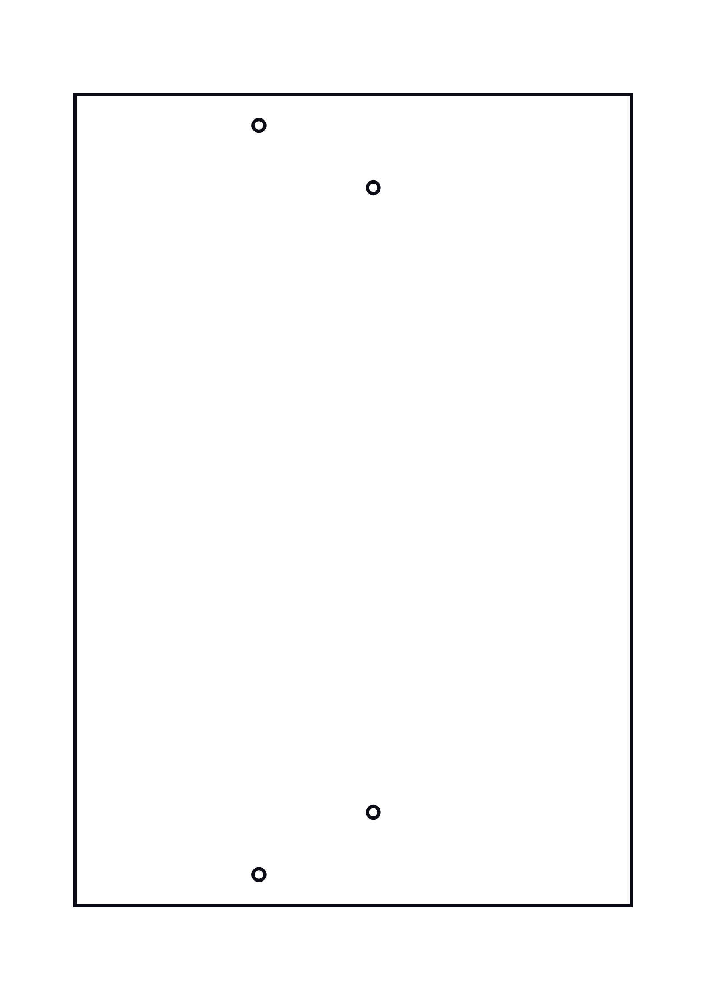
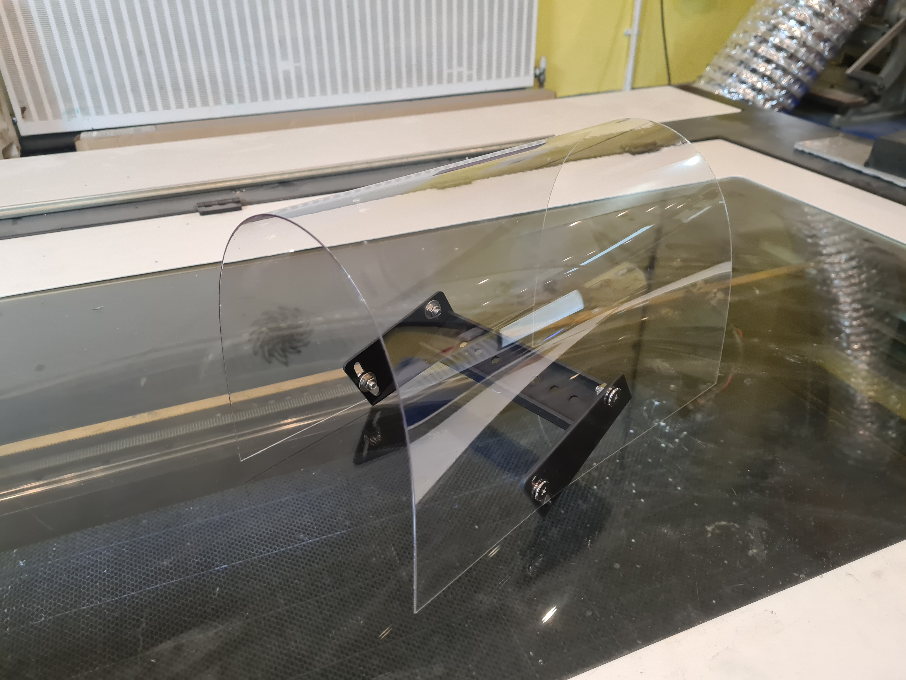
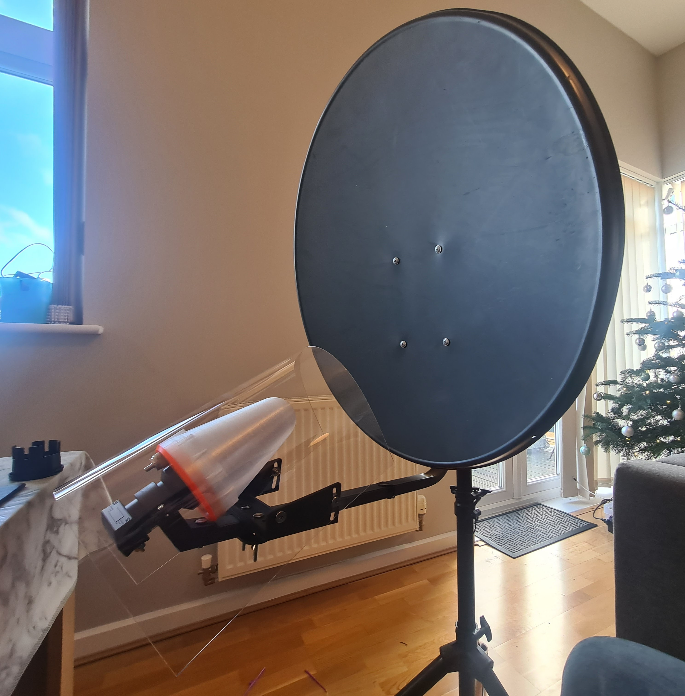

# QO100 Feed Rain Cover

I've created a rain cover for my QO100 dual band Ice Cone Feed from [DC8PAT](https://www.qrz.com/db/DC8PAT) to offer some additional protection against the elements and help keep the Coax dry. The Ice Cone Feed is a similar diameter to the POTY so it should also be compatible. 

It fits onto the wildly available "Dual LNB Rain Cover" brackets that go under several brands / names but have identical dimensions and probably come out of the same mould. 

### Images

This is what the layout looks like. This image is just for reference so don't use it for cutting:

Here it is attached to the bracket:

And the finished product:

### Files

The plans are provided as SVG, DXF, and PDF, which should cover most laser cutters and CAD software.

### Construction

I made the mount out of an A2 1mm PETG sheet that was cut at 50mm/sec on a Laser Cutter at [The London Hackspace](http://hack.rs/) but cutting paramaters will vary on different cutters. You might also be able to use Polypropylene. I tested a small 0.8mm thick piece and whilst the lines weren't as sharp as PETG it cut well and didn't have too much flex. 

Both these materials are a little more unusual for laser cutting so if using a shared machine you should check its a permitted material before cutting. You should also study the datasheets for your material to ensure it doesn't produce Chlorine or other noxious fumes.

Once cut you can mount it on the bracket using the nuts and bolts provided with the original cover.

### Licence

This project is licensed under the [Creative Commons CC BY-SA 4.0](https://creativecommons.org/licenses/by-sa/4.0/) licence.

You are free to copy and redistribute the material in any medium or format, as well as adapt, remix, transform, and build upon the material for any purpose, even commercially.

